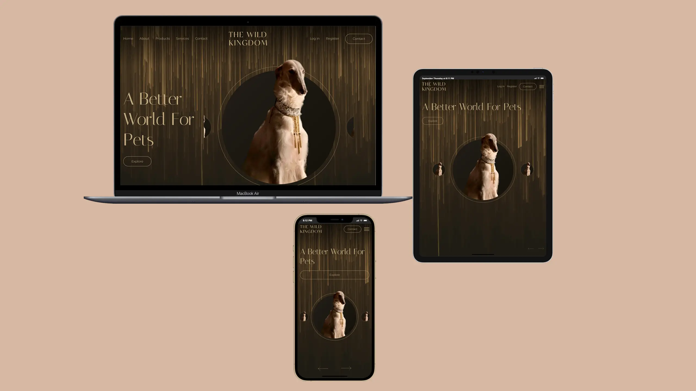

# Wild Kingdom

**Role:**  
Front-End Developer | Responsive Design | JavaScript Interactivity | Custom Popups  

🌐 [View Live Project](https://oleksandrmul.github.io/wild-kingdom/)

---

## Overview  
Built a cozy and engaging **one-page landing website** for a small business offering food, toys, and healthcare services for pets. 
The project features the slogan “A Better World for Pets” and aims to provide a welcoming digital experience for pet owners.  

---

## Key Achievements  
- ✅ Implemented **smooth scroll navigation, hover animations, and parallax effects** for an immersive feel.  
- ✅ Designed a **responsive Swiper slider** in the hero section, ensuring structural reliability across all devices.  
- ✅ Developed **custom JavaScript popups (modals)**, including interactive forms.  
- ✅ Integrated **Lightgallery JS**, allowing users to explore and even download gallery images.  
- ✅ Added a **CSS-animated call-to-action button** in the contact section to encourage engagement.  
- ✅ Followed **semantic HTML5, SCSS structuring, and mobile-first principles** to guarantee performance.  

---

## Outcome  
Delivered a **responsive and visually appealing landing page** with smooth interactions and business-oriented functionality. The gallery, parallax effects, and custom modals add interactivity while maintaining a calm, welcoming aesthetic.  

---

## Conclusions  
This landing page blends **gentle design, smooth interactivity, and business-focused features** to create a welcoming digital presence for pet owners. From custom modals to a responsive hero slider and an interactive gallery, every detail was crafted to build trust and engagement.  

If you’re seeking a **developer who transforms creative concepts into reliable, conversion-driven websites**, I’d be glad to bring your vision to life 🐾✨.  

